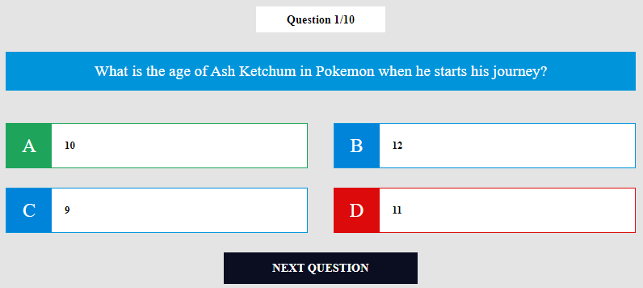

[![Dependencies][dependency-shield]][dependency-url]
[![LinkedIn][linkedin-shield]][linkedin-url]

# React.js App example
Simple quiz based on [Open Trivia Quiz API](https://opentdb.com/).
This project was bootstrapped with [Create React App](https://github.com/facebook/create-react-app).



### Built With

* [![Javascript][Javascript.io]][Javascript-url]
* [![React][React.io]][React-url]
* [![Redux][Redux.io]][Redux-url]
* [![NodeJs][NodeJs.io]][NodeJs-url]

## Pre-installations

#### Npm install:

  ```sh
  npm install npm@latest -g
  ```
```sh
npm install react-scripts --save
```

#### Reactstrap install:

  ```sh
  npm install reactstrap bootstrap
  ```

#### Clone the repo:

```sh
git clone https://github.com/Lesash13/react_quiz_app.git
```

## Usage

#### Build:
The build artifacts will be stored in the `build` directory.

``` sh
npm run build
```

#### Generate new component:
You can also use `ng generate directive|pipe|service|class|guard|interface|enum|module`.

```sh
ng generate component component-name
```

#### Development server:
Navigate to `http://localhost:3000/

```sh
npm start
```


<!-- MARKDOWN LINKS & IMAGES -->

[dependency-shield]: https://img.shields.io/badge/Dependency_Graph-darkgreen?style=for-the-badge

[dependency-url]: https://github.com/Lesash13/react_quiz_app/network/dependencies

[linkedin-shield]: https://img.shields.io/badge/-LinkedIn-black.svg?style=for-the-badge&logo=linkedin&colorB=darkblue

[linkedin-url]: https://www.linkedin.com/in/victoriya-mitrofanova-96839278/

[Javascript.io]: https://img.shields.io/badge/-Javascript-lightyellow?style=for-the-badge&logo=javascript

[Javascript-url]: https://www.javascript.com/

[React.io]: https://img.shields.io/badge/React-black?style=for-the-badge&logo=react

[React-url]: https://reactjs.org/

[Redux.io]: https://img.shields.io/badge/-Redux-blueviolet?style=for-the-badge&logo=redux

[Redux-url]: https://redux.js.org/

[NodeJs.io]: https://img.shields.io/badge/-Node.js-green?style=for-the-badge&logo=Node.js

[NodeJs-url]: https://nodejs.org/en/
